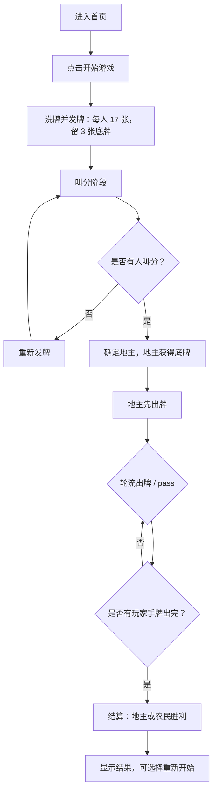

# 斗地主网页版需求文档

## 1. 产品概述

一款可直接在浏览器游玩的经典三人斗地主游戏。玩家与两名 AI 农民对战，体验叫分、出牌、炸弹、火箭等核心玩法；无需注册、无后端依赖，打开页面即可开始。

## 2. 核心功能

### 2.1 用户角色

| 角色 | 说明 | 核心权限 |
|------|------|----------|
| 玩家 | 真人用户 | 叫分、选牌、出牌、 pass |
| AI 农民 | 电脑控制的两名对手 | 自动叫分、自动出牌 |

### 2.2 功能模块

1. **开始界面**：游戏标题、开始按钮、规则简述。
2. **叫分阶段**：玩家选择 1/2/3 分或“不叫”，AI 自动叫分，最高分者成为地主并获得 3 张底牌。
3. **出牌阶段**：玩家点击选牌、出牌或 pass；AI 按策略自动出牌。
4. **结算弹窗**：显示胜负、谁是地主、剩余手牌、重新开始。

### 2.3 页面详情

| 页面 | 模块 | 功能描述 |
|------|------|----------|
| 首页 | Hero 区 | 展示标题、开始游戏按钮、简短规则说明 |
| 游戏页 | 牌桌区 | 展示三家手牌（AI 背面、玩家正面）、地主标识、当前回合高亮 |
| 游戏页 | 操作区 | 叫分按钮 / 出牌、pass、提示按钮 |
| 游戏页 | 出牌历史 | 展示最近一轮各家打出的牌型 |
| 结算弹窗 | 结果区 | 胜负提示、重新开始按钮 |

## 3. 核心流程

### 3.1 主要玩法流程

### 3.2 出牌规则（支持的牌型）

- **单张**：任意一张牌。
- **对子**：两张点数相同。
- **三张**：三张点数相同。
- **三带一 / 三带二**：三张 + 一张单牌 / 一对。
- **顺子**：5 张及以上连续点数的单牌（2 与大小王不能参与）。
- **连对**：3 对及以上连续点数的对子。
- **飞机**：两组及以上连续点数的三张，可带等量单牌或对子。
- **炸弹**：四张点数相同。
- **火箭**：大王 + 小王，最大牌型。

牌型比较：同类型按点数比较；炸弹可压除火箭外的所有牌型；火箭最大。

## 4. 用户界面设计

### 4.1 设计风格

- **主题**：「中式茶馆牌桌」——深翡翠绿桌面、暗红木边框、金色描边，营造传统棋牌室氛围。
- **主色**：
  - 桌面背景：#0d3b2e（深绿）+ 径向渐变高光
  - 木框/强调：#5c2b18（暗红棕）
  - 金色：#d4a653
  - 文字：#f7f3e8（米白）
- **牌面**：
  - 使用 Unicode 花色 + 点数文字，红黑两色区分红黑花色。
  - 大王、小王使用金色文字 + “王”字。
  - 牌背：暗红木纹纹理 + 金色中式回纹装饰。
- **字体**：
  - 标题使用楷体/宋体风格字体：`"STKaiti", "KaiTi", "SimSun", serif`。
  - 数字与按钮使用无衬线：`"PingFang SC", "Microsoft YaHei", sans-serif`。
- **按钮**：
  - 主按钮：金色描边、深红棕背景、圆角 8px、hover 时轻微上浮并增强阴影。
  - 操作按钮：出牌绿色、pass 灰色、提示蓝色。
- **动效**：
  - 发牌时牌从牌堆飞入各玩家区域。
  - 选中牌向上平移 12px。
  - 出牌时牌滑向桌面中央并轻微放大。
  - 炸弹/火箭触发桌面震动与金色粒子闪烁。

### 4.2 页面设计概览

| 页面 | 模块 | UI 元素 |
|------|------|---------|
| 首页 | Hero | 居中大标题“斗地主”、金色印章式副标题、“开始游戏”主按钮 |
| 游戏页 | 牌桌 | 顶部左侧/右侧 AI 手牌背面、中央最近出牌区、底部玩家手牌 |
| 游戏页 | 信息栏 | 当前回合高亮、地主徽章、剩余手牌数 |
| 游戏页 | 操作区 | 叫分按钮组 / 出牌控制按钮组 |
| 结算弹窗 | 结果 | 胜负标题、双方身份、重新开始按钮 |

### 4.3 响应式

- 桌面优先设计，牌桌区域固定比例。
- 移动端：玩家手牌横向可滚动，操作按钮放大以便触摸；AI 手牌堆叠显示数量。

## 5. 非功能性需求

- **性能**：单局游戏状态完全在前端维护，AI 决策需在 500ms 内完成。
- **兼容性**：支持 Chrome、Edge、Safari、Firefox 最新两个大版本。
- **可访问性**：按钮具备清晰焦点状态，牌面使用颜色+文字双重信息。
