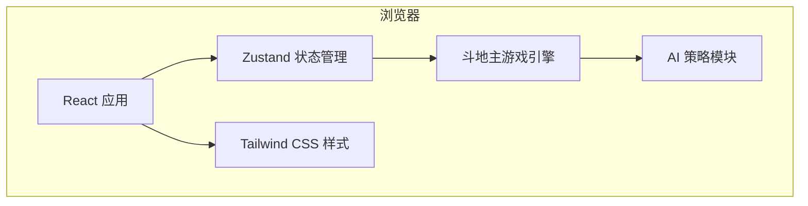

# 斗地主网页版技术架构

## 1. 架构设计



- **纯前端架构**：无需后端服务，游戏逻辑、状态、AI 均在浏览器内完成。
- **状态管理**：Zustand 集中管理游戏状态（阶段、玩家、手牌、出牌记录、胜负）。
- **游戏引擎**：独立的 TypeScript 模块，负责发牌、叫分、牌型解析、出牌合法性校验、胜负判定。
- **AI 策略模块**：基于规则与启发式算法，实现 AI 叫分与出牌。

## 2. 技术选型

- **前端框架**：React 18 + TypeScript
- **构建工具**：Vite
- **样式方案**：Tailwind CSS 3
- **状态管理**：Zustand
- **路由**：无需多路由，单页面应用
- **图标**：lucide-react
- **测试**：Vitest（可选，用于核心牌型逻辑单元测试）

## 3. 路由定义

| 路由 | 用途 |
|------|------|
| `/` | 单页应用入口，根据游戏阶段渲染首页或游戏界面 |

## 4. 数据模型

### 4.1 核心类型

```typescript
// 牌的点数：3-10, J, Q, K, A, 2, 小王, 大王
type Rank = '3' | '4' | '5' | '6' | '7' | '8' | '9' | '10' | 'J' | 'Q' | 'K' | 'A' | '2' | 'JOKER_SMALL' | 'JOKER_BIG';

// 花色：黑桃、红桃、梅花、方块（大小王无花色）
type Suit = 'SPADE' | 'HEART' | 'CLUB' | 'DIAMOND' | 'NONE';

interface Card {
  id: string;
  rank: Rank;
  suit: Suit;
  value: number; // 用于比较大小：3=3,...,A=14,2=15,小王=16,大王=17
}

interface Player {
  id: 'player' | 'ai1' | 'ai2';
  name: string;
  hand: Card[];
  isLandlord: boolean;
  isAI: boolean;
}

// 牌型
type PatternType =
  | 'SINGLE' | 'PAIR' | 'TRIPLE' | 'TRIPLE_WITH_SINGLE' | 'TRIPLE_WITH_PAIR'
  | 'STRAIGHT' | 'DOUBLE_STRAIGHT' | 'PLANE' | 'PLANE_WITH_WINGS'
  | 'BOMB' | 'ROCKET';

interface Pattern {
  type: PatternType;
  length?: number; // 顺子/连对/飞机长度
  mainValue: number; // 主牌点数
  kickerCount?: number; // 带牌数量
}
```

### 4.2 游戏状态

```typescript
interface GameState {
  phase: 'MENU' | 'DEALING' | 'BIDDING' | 'PLAYING' | 'SETTLEMENT';
  players: Player[];
  deck: Card[];
  landlordCards: Card[];
  currentBid: number;
  bidder: Player['id'] | null;
  landlordId: Player['id'] | null;
  currentTurn: Player['id'];
  lastPlay: { playerId: Player['id']; cards: Card[]; pattern: Pattern } | null;
  selectedCardIds: string[];
  winner: Player['id'] | null;
  logs: string[];
}
```

## 5. 模块划分

| 文件/目录 | 职责 |
|-----------|------|
| `src/App.tsx` | 顶层组件，根据 phase 渲染首页或游戏页 |
| `src/store/gameStore.ts` | Zustand store，封装游戏状态与 action |
| `src/engine/cards.ts` | 牌组生成、洗牌、排序工具 |
| `src/engine/patterns.ts` | 牌型识别与比较 |
| `src/engine/rules.ts` | 出牌合法性校验、回合流转、胜负判定 |
| `src/engine/ai.ts` | AI 叫分与出牌策略 |
| `src/components/MenuScreen.tsx` | 首页界面 |
| `src/components/GameTable.tsx` | 牌桌布局 |
| `src/components/PlayerHand.tsx` | 玩家手牌区 |
| `src/components/AIHand.tsx` | AI 手牌背面区 |
| `src/components/PlayArea.tsx` | 中央出牌展示区 |
| `src/components/Controls.tsx` | 叫分/出牌操作按钮 |
| `src/components/SettlementModal.tsx` | 结算弹窗 |
| `src/components/Card.tsx` | 单张牌视觉组件 |

## 6. AI 策略简述

### 6.1 叫分策略

- 统计手牌中炸弹、2、王、A 的数量。
- 当牌力较强（ bomb >=1 或大牌较多）时叫 2-3 分；牌力一般时叫 1 分；牌力弱时不叫。

### 6.2 出牌策略

- **首出/新一轮**：优先出较小单牌、对子、顺子等杂牌；若牌力好可尝试飞机/连对。
- **接牌**：
  - 队友（农民之间）出牌时，除非牌型很大且必要，否则选择 pass，保留火力。
  - 对手（地主）出牌时，尝试用能压过的最小牌型接牌。
- **压牌优先级**：炸弹/火箭留到关键时刻；若 AI 手牌极少且能一次性走完，则优先出完。

## 7. 开发约定

- 所有 UI 文案使用中文。
- 组件文件保持小于 300 行，复杂逻辑拆分到 engine。
- 样式使用 Tailwind CSS 工具类，关键主题色通过 CSS 变量统一。
- 游戏核心逻辑（牌型、规则）优先写单元测试，保证玩法正确。
